<h1 align="center">MetroloJ plugin: WARNING</h1>
A bug has been found in the way the reference distance was computed for co-alignement analysis. The bug is now corrected. This repository contains the explanations together with a new version of the plugin including the correct way to do the calculations.

---
---

<h1 align="center">MetroloJ plugin: supporting documents</h1>

Several documents are available to download. Their source code ($\LaTeX$) is available for the [docs/src/ folder](docs/src).

* [MetroloJ conference paper (ImageJ conference, oct 2010)](docs/10-10-26_Paper_MetroloJ_-_Conf_IJ.pdf)
* [MetroloJ conference presentation (ImageJ conference, oct 2010)](docs/10-10-26_Presentation_MetroloJ_-_Conf_IJ.pdf)
* [JACoP conference paper (ImageJ conference, nov 2008)](docs/JACoP_v2_0__improving_the_user_experience_with_co_localization_studies.pdf), explaining how the reference distance is calculated in 3D
* [PDF version of the manual](docs/MetroloJ_Manual_v2.pdf)

---
---

<h1 align="center">MetroloJ plugin: the manual</h1>

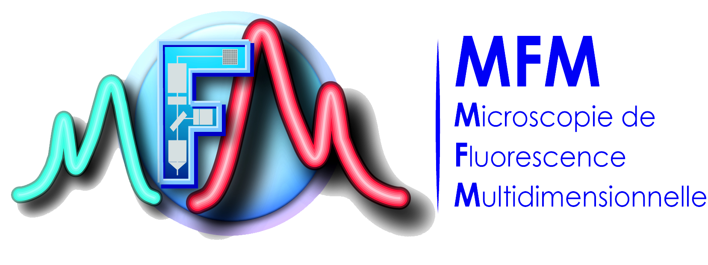

*This manual and plugin comes as a result of a collective work of the "Metrology group" within the [French Technological Network of the Multi-Dimensional Fluorescence Microscopies (RT-MFM)](http://rtmfm.cnrs.fr/), supported by the ["Mission pour les Initiatives Transverses et Interdisciplinaires" (MITI)](https://miti.cnrs.fr/)).
The authors would like to thank:
Aurélie Le Ru for reporting the time-shift bug.
François Waharte for beta-testing and bug tracking.
Claude-Marie Bachelet and Aurélien Dauphin for the images used in fig. "Co-alignement report".
Aude Jobart for images of spinning disc PSFs.*

*We would like to acknowledge the work of all the valuable beta-tester
and the member of the "groupe de travail Métrologie du RT-MFM" who made
feedback on the plugins collection and helped us improving and adapting
it:\
Pierre Bourdoncle, Anne Cantereau, Julien Cau, Christophe Chamot, Julien Cianfichi, Aurélien Dauphin, Olivier Duc, Sylvain De Rossi, Stéphanie Dutertre, Aude Jobart-Malfait, Christophe Klein, Marc Lartaud, Patricia Le Baccon, Aurélie Le Ru, Meriem Garfa-Traoré, Camille Lebugle, Sandrine Leveque-Fort, Christophe Machu, Laure Malicieux, Christel Poujol, Richard Schwartzmann, Damien Schapman, Marie-Noëlle Soler, Nicolas Tissot, Yves Usson and François Waharte.*

---

# How to install the plugin ?
First, close ImageJ in case the software is already running. Copy and paste the ***MetroloJ.jar*** file into the ImageJ/Plugins folder.
Download the ***iText library*** by following [this link](http://prdownloads.sourceforge.net/itext/iText-2.1.5.jar). This library will be used by the plugin to generate pdf reports. Copy and paste it into the ImageJ/Plugins folder. Restart ImageJ.
A ***MetroloJ*** entry should appear under the ImageJ's plugins menu. It contains 5 entries:

* Generate CV report
* Generate field illumination report
* Generate PSF report
* Generate axial resolution report
* Generate co-alignement report.

---

# Generate CV report
## How to generate the images ?
### How to prepare the sample ?
*There is no real sample preparation, the only required material is detailed here after.*

#### What do I need ?
* ***Fluorescent slides:*** made of fluorescent plastic, the fluorescent slide provides the user with a uniformly labelled sample. They might be ordered from [Omega Opticals](https://www.omegafilters.com/index.php?page=prod_rslides_pro) or [Microscopy Education](http://www.microscopyeducation.com/fluorrefslides.html).
* ***Alternatively***, large diameter uniformly labelled beads might also be used and prepared as explained under the ["Generate co-alignement report" section](#what-does-it-do--4).

### How to acquire the image ?
The following chart summarizes the procedure for optimal image acquisition, in order to determine the CV of several PMTs on a confocal microscope.

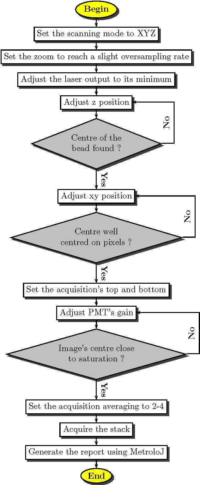

## What does it do ?
1. The plugin measures the average intensity (µ) and the standard deviation ($\sigma$) of the gray levels within a user defined region of interest (ROI) for each image of a stack corresponding to acquisitions made for each PMT to compare.
2. It calculates the coefficient of variation (CV) as follows:

$$CV = \frac{\sigma}{\mu}$$

3. The normalized CV is then calculated as the ratio of the current image's CV over the minimum retrieved CV over all images.

## How to use it ?
1. Start ImageJ.
2. Open a stack of images containing the acquisitions made with the PMTs to analyze.
3. Launch the plugin by going to Plugins/MetroloJ/Generate CV report.
4. In case the image has not been spatially calibrated, a message error pops up: click on Ok. In the calibration dialog box provide the appropriate values, then re-launch the plugin.
5. The plugin's interface should appear:

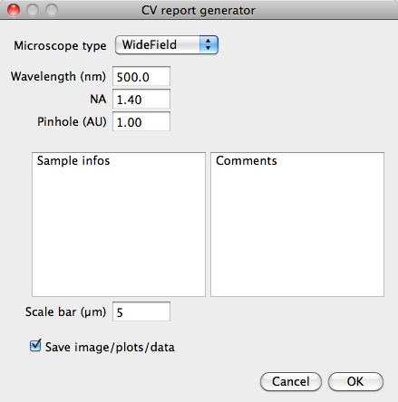

6. Choose the microscope's type, enter the emission wavelength, the numerical aperture of the objective and the pinhole aperture. Sample informations and some comments might also be provided using the appropriate boxes. Ticking the "Save image/plots/data" will generate:
	* a jpeg panel containing all the analyzed images overlayed with the user defined ROIs;
	* a jpeg image of the intensity distribution (histogram) for each image, within the user defined ROIs;
	* a zip file containing the user defined ROIs;
	* two files containing tabulation separated values of the histograms, and for the data used to calculate the raw and normalized CVs (excel files);
8. Click on Ok: a new dialog box appears, inviting the user to choose a folder where all data will be saved.
9. The pdf report is generated, and appropriate files saved.

## What's on the report ?
The CV report is composed of two pages based on the informations provided by the user. It is composed of up to 6 sections:

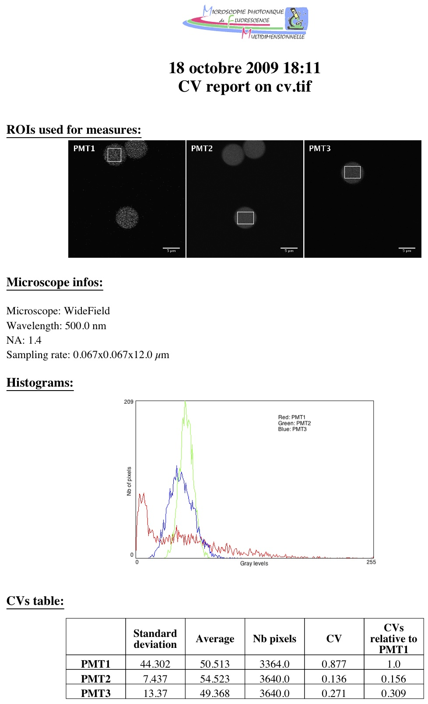

* ***ROIs used for measures***: montage composed of the images acquires using each PMT, overlayed with the user defined ROIs used for measurements.
* ***Microscope infos***: summarizes informations about the acquisition system and the image's calibration.
* ***Histograms***: plot of the gray level distributions within the user defined ROIs for each image.
* ***CVs table***: contains for each image the µ and $\sigma$ values, as well as the ROI size (expressed in number of pixels), the raw and normalized CVs.
* ***Sample infos (optional)***: contains the informations entered by the user in the "Sample infos" section of the interface.
* ***Comments (optional)***: contains the informations entered by the user in the "Comments" section of the interface.

## Known issues (to date...) and workarounds (if any...)

None...yet.

---

# Generate field illumination report
## How to generate the images ?
### How to prepare the sample ?
*There is no real sample preparation, the only required material is detailed here after.*

#### What do I need ?
* ***Fluorescent slides:*** made of fluorescent plastic, the fluorescent slide provides the user with a uniformly labelled sample. They might be ordered from [Omega Opticals](https://www.omegafilters.com/index.php?page=prod_rslides_pro) or [Microscopy Education](http://www.microscopyeducation.com/fluorrefslides.html).

### How to acquire the image ?
The following chart summarises the procedure for optimal image acquisition, in order to determine field illumination homogeneity on a confocal microscope.

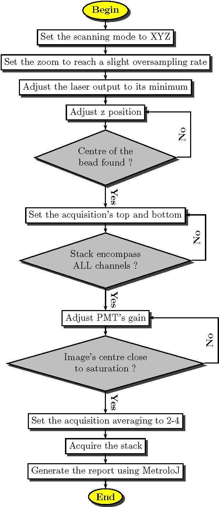

## What does it do ?
1. The plugin generates a normalized view of the image. Its maximum intensity pixel being set to 100%, an iso-intensity map is drawn, the intensity step between two successive areas being set by user.
2. The maximum intensity pixel coordinates, the image barycenter's coordinates and the barycenter of the 100% region are retrieved.
3. From the input image, the plugin will generate and analyze four intensity profiles along the horizontal and vertical axis and both diagonals passing through the image's center.
4. Raw and normalized intensities of 8 characteristic pixels, corresponding to the 8 intercepts of the lines along which the intensity profiles are retrieved, are determined.

## How to use it ?
1. Start ImageJ.
2. Open an image containing the field illumination to analyze.
3. Launch the plugin by going to Plugins/MetroloJ/Generate field illumination report
4. In case the image has not been spatially calibrated, a message error pops up: click on Ok. In the calibration dialog box provide the appropriate values, then re-launch the plugin.
5. The plugin's interface should appear:

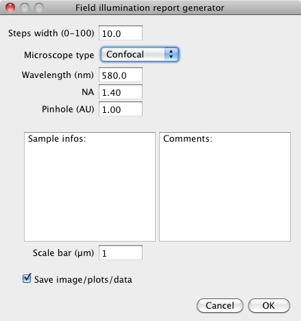

6. Choose the microscope's type, enter the emission wavelength, the numerical aperture of the objective and the pinhole aperture. Sample informations and some comments might also be provided using the appropriate boxes. Ticking the "Save image/plots/data" will generate:
	* a jpeg image of the illumination pattern;
	* a jpeg image of the intensity profiles;
	* two files containing tabulation separated values of the intensity profiles, and for the profiles associated statistics (excel files);
7. Click on Ok: a new dialog box appears, inviting the user to choose a folder where all data will be saved.
8. The pdf report is generated, and appropriate files saved.

## What's on the report ?
The field illumination report is composed of two pages based on the informations provided by the user. It is composed of up to 6 sections:

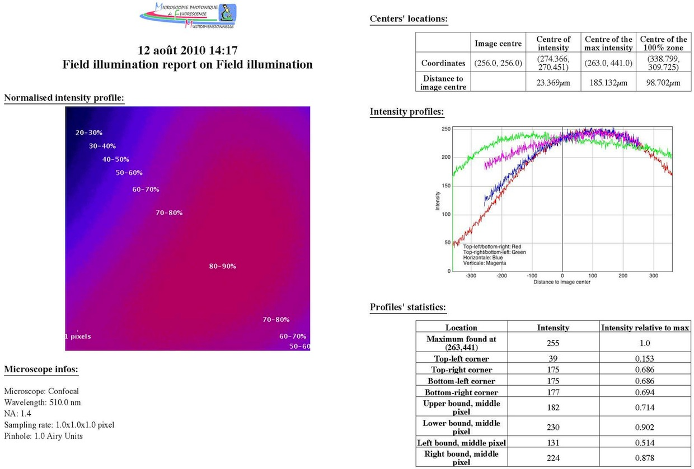

   
* ***Normalized intensity profile***: normalized view of the field illumination, in false color, separated into iso-intensity zones which
step width is user defined.
* ***Microscope infos***: summarizes informations about the acquisition system and the image's calibration.
* ***Centers' location***: contains the coordinates of points of interest: the image center, the centre of intensity, the center of maximum intensity and the centre of the 100% zone. It also displays the distances between the 3 later and the image's geometrical center.
* ***Intensity profiles***: contains a plot of the intensity profiles along the the horizontal and vertical axis and both diagonals passing through the image's center.
* ***Profiles' statistics***: contains both raw and normalized intensities of 8 characteristic pixels, corresponding to the 8 intercepts of the lines along which the intensity profiles are retrieved.
* ***Sample infos (optional)***: contains the informations entered by the user in the "Sample infos" section of the interface.
* ***Comments (optional)***: contains the informations entered by the user in the "Comments" section of the interface.

## Known issues (to date...) and workarounds (if any...)
None...yet.

---

# Generate PSF report
## How to generate the images ?
### How to prepare the sample ?
*This sample preparation is aimed at obtaining an array of fluorescent beads, well appart one from the other, and stably stuck to a coverslip.*

#### What do I need ?
* ***Fluorescent beads:*** their outer diameter should be below the resolution of the system to test. Two types of beads might be used:
	* Mono-labelled beads. ex: Molecular Probes' [PS-Speck, Ref. P-7220](http://probes.invitrogen.com/media/pis/mp07220.pdf). However, their diameter of 0.17µm is a bit high for high NA objectives...
	* Multi-labelled beads. ex: Molecular Probes' [TetraSpeck, Ref. T-7279](http://probes.invitrogen.com/media/pis/mp07279.pdf). Their diameter of 0.1µm is ideal, though having multi-labelled beads may lead to weaker signals...
* ***Regular slides***.
* ***Regular coverslips***: type 1.5 i.e. 0.17mm thick, either polylysine coated or not.
* If applicable, ***Poly-L-lysine solution*** (0.1 % (w/v) in $H_{2}O$) ex: [Sigma-Aldrich, Ref. P8920](http://www.sigmaaldrich.com/etc/medialib/docs/Sigma/generalinformation2/p8920.Par.0001.File.tmp/p8920.pdf).
* ***Ethanol***.
* ***Regular distilled water***.
* ***Mounting medium***: should be the same as for the regular, biological samples. Avoid using DAPI containing mounting media.
* ***Nail polish***: only in case the mounting solution is not a setting medium.

#### How do I do ?
1. Clean the coverslip and the slide using ethanol.
2. Dilute the polylysine stock solution to 1/5.
3. Poor a sufficient amount of the diluted polylysine solution onto the coverslip surface (typically, 200µl for a 24x24mm coverslip) and leave to coat for 15-30 minutes. The solution hardly covers the full surface, so don't hesitate to use the pipet's tip to force the polylysine into the coverslip's corners.
4. Rince the coverslip 2-3 times in distilled water, then drain off the liquid.
5. Use a vortex to mix the beads' stock suspension.
6. Dilute the beads suspension in water. Here are some tips and facts:
	* Typically, 200µl for a 24x24mm coverslip will be requiered;
	* In general, the 0.1µm [TetraSpeck](http://probes.invitrogen.com/media/pis/mp07279.pdf) should be diluted to 1/1,000, the [PS-Speck](http://probes.invitrogen.com/media/pis/mp07220.pdf) from 1/10,000 to 1/40,000;
	* It is advised to first dilute the beads to 1/1,000, then make further  serial dilution to achieve the appropriate beads' density on slide;
	* Tests should be done to define the appropriate dilution ratio;
	* Always vortex the suspensions between and after dilutions.
7. Poor a sufficient amount of the diluted beads suspension onto the coverslip surface and leave to sediment for at least 30 minutes. The solution hardly covers the full surface, so don't hesitate to use the pipet's tip to force the suspension into the coverslip's corners.
8. Rince the coverslip 2-3 times in distilled water to remove the unattached beads, then drain off the liquid.
9. Mount the coverslip on the slide by using the mounting medium. In case of non setting media, the coverslip should be sealed onto the slide using nail polish, while avoiding the latter to come under the coverslip.

NB: Other methods exists in order to produce beads slides, involving dilution in ethanol and leaving the suspension to evaporate. In this case, tests of higher beads dilution might be required. Please note that already prepared beads slides are commercially available (see [TetraSpeck Fluorescent Microspheres Size Kit mounted on slide](http://probes.invitrogen.com/media/pis/mp07279.pdf)). However, this kind of preparation doesn't always match with the real *in situ* resolution as the mounting medium might be different from the one used in everyday acquisitions.

### How to acquire the image ?
The following chart summarises the procedure for optimal image acquisition, in order to determine the resolutions on a confocal microscope.

## What does it do ?
1. The plugin will generate a maximum intensity projection of the stack along the z axis. The (x, y) coordinates of the maximum intensity pixel (MIPix) are then collected. A XZ cross-section is generated, along a line passing through the previously determined 2D MIPix. From this image, the z coordinate of the MIPix is defined.
2. The z slice is set to the z MIPix coordinate. The x profile and y profile are collected along the line passing through the MIPix. The z profile is collected on the XZ view, along the line passing through the MIPix.
3. All three profiles are fitted to a Gaussian, using the following equation and ImageJ's built-in curve fitting function:

$$y = a + (b-a)e^\frac{-(x-c)^2}{2d^2}$$

4. The resolution i.e. the full-width at half-maximum (FWHM) is calculated as follows for each profile, based on the parameters retrieved from the fitting: 

$$FWHM=2d\sqrt{2ln(2)}$$

5. The theoretical resolutions are calculated as follows, depending on the microscope's type: 

$$\begin{aligned}
            xy_{resol, wide-field}=\frac{0.61*\lambda_{emission}}{NA}\\
            z_{resol, wide-field}=\frac{2*\lambda_{emission}}{NA^2}\\
            xy_{resol, confocal}=\frac{0.4*\lambda_{emission}}{NA}\\
            z_{resol, confocal}=\frac{1.4*\lambda_{emission}}{NA^2}
\end{aligned}$$

## How to use it ?
1. Start ImageJ.
2. Open a stack containing exactly one bead.
3. Launch the plugin by going to Plugins/MetroloJ/Generate PSF report.
4. In case the stack has not been spatially calibrated, a message error pops up: click on Ok. In the calibration dialog box provide the appropriate values, then re-launch the plugin.
5. The plugin's interface should appear:

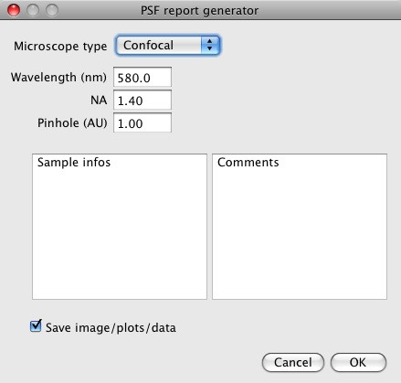

6. Choose the microscope's type, enter the emission wavelength, the numerical aperture of the objective and the pinhole aperture. Sample informations and some comments might also be provided using the appropriate boxes. Ticking the "Save image/plots/data" will generate:
	* a jpeg image of the side-views;
	* three files containing tabulation separated values of the x, y and z profiles (excel files);
	* a file containing tabulation separated values of the report's summary.
7. Click on Ok: a new dialog box appears, inviting the user to choose a folder where all data will be saved.
8. The pdf report is generated, and appropriate files saved.

## What's on the report ?
The PSF report is composed of two to three pages depending on the informations provided by the user. It is composed of up to 8 sections:

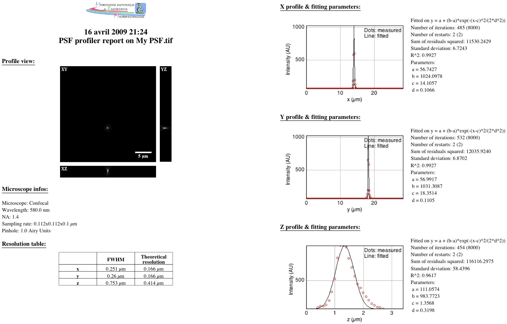

* ***Profile view***: image composed of three maximum intensity projections, XY, XZ and YZ;
* ***Microscope infos***: summarizes informations about the acquisition system and the image's calibration;
* ***Resolution table***: carries both the resolutions determined by fitting and the theoretical, calculated ones;
* ***x profile and fitting parameters***: contains a plot of the intensity profile along the x axis and the fitted curve. On the right side of the graph stand the fitting parameters:
	* equation against which the profile is fitted;
	* number of iterations: self-explanatory;
	* sum of residuals squared: sum of the differences between the original intensity values and the fitted ones, squared;
	* standard deviation: standard deviation of the residuals;
	* the correlation coefficient $R^{2}$ (gives indication on the fitting goodness);
	* the Gaussian's constants a to d, c being the position of the beads centre along the x axis.
* ***y profile and fitting parameters***: same as previous along y axis;
* ***z profile and fitting parameters***: same as previous along z axis;
* ***Sample infos (optional)***: contains the informations entered by the user in the "Sample infos" section of the interface;
* ***Comments (optional)***: contains the informations entered by the user in the "Comments" section of the interface.

## Known issues (to date...) and workarounds (if any...)
None...yet.

---

# Generate axial resolution report
## How to generate the images ?
### Prepare the sample
*This sample preparation is aimed at fixing a reflective surface on a slide, overlaid by mounting medium, topped by a coverslip.*

#### What do I need ?
* ***Single reflector mirror:*** ex: Edmund optics' [4-6 Wave Mirror 20mm x 20mm Enhanced Aluminum, Ref. NT43-872](http://www.edmundoptics.com/onlinecatalog/displayproduct.cfm?productid=1754&showall).
* ***Ethanol***.
* ***Glue***.
* ***Regular slides***.
* ***Mounting medium***: should be the same as for the regular, biological samples. Avoid using DAPI containing mounting media. Alternatively, ***immersion oil*** might also be used as a mounting solution.
* ***Regular coverslips***: type 1.5 i.e. 0.17mm thick.
* ***Nail polish***: only in case the mounting solution is not a setting medium.

#### How do I do ?
1. Clean the coverslip, the mirror and the slide using ethanol;
2. Glue the mirror to the coverslip. Warning: make sure that you glue the glass side of the mirror ! Alternatively, setting mounting medium might be used to stick the mirror on the slide;
3. Wait for the glue to set;
4. Mount the coverslip on the slide/mirror by using the mounting medium (or immersion oil). Remove excess of solution by pressing firmly on the coverslip. In case of non setting media, the coverslip should be sealed onto the slide or the mirror (depending on its thickness) using nail polish.

### How to acquire the image ?
The following chart summarises the procedure for optimal image acquisition, in order to determine the axial resolution on a confocal microscope.

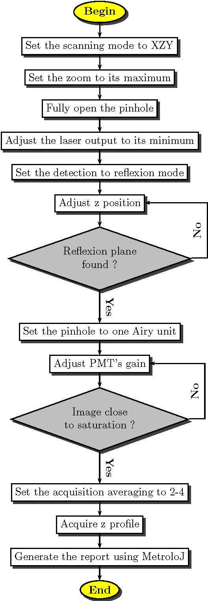

## What does it do ?
1. After the user has defined a rectangular ROI, the plugin will generate an average intensity projection of the image along the y axis.
2. The resulting 1D intensity profile is then fitted to a Gaussian, using the following equation and ImageJ's built-in curve fitting function:

$$y = a + (b-a)e^\frac{-(x-c)^2}{2d^2}$$

3. The axial resolution i.e. the full-width at half-maximum (FWHM) is calculated as follows, based on the parameters retrieved from the fitting:

$$FWHM=2d\sqrt{2ln(2)}$$

4. The theoretical resolutions are calculated as follows, depending on the microscope's type:
	
$$\begin{aligned}
	z_{resol, wide-field}=\frac{2*\lambda_{emission}}{NA^2}\\
	z_{resol, confocal}=\frac{1.4*\lambda_{emission}}{NA^2}
\end{aligned}$$

## How to use it ?
1. Start ImageJ.
2. Open the image of the z profile.
3. Launch the plugin by going to Plugins/MetroloJ/Generate axial resolution report.
4. In case the image has not been spatially calibrated, a message error pops up: click on Ok. In the calibration dialog box provide the appropriate values, then re-launch the plugin.
5. The plugin's interface should appear:

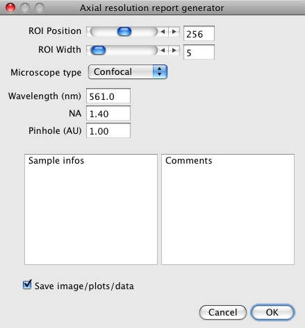

6. Select the position of the ROI and adjust its width.
7. Choose the microscope's type, enter the emission wavelength, the numerical aperture of the objective and the pinhole aperture. Sample
informations and some comments might also be provided using the appropriate boxes. Ticking the "Save image/plots/data" will generate:
	* a calibrated jpeg image of the profile, including the ROI's outlines;
	* a file containing tabulation separated values of the z profile (excel files);
	* a file containing tabulation separated values of all the numerical data from the report.
8. Click on Ok: a new dialog box appears, inviting the user to choose a folder where all data will be saved.
9. The pdf report is generated, and appropriate files saved.

## What's on the report ?
The axial resolution report is composed of two pages. It is composed of up to 6 sections:

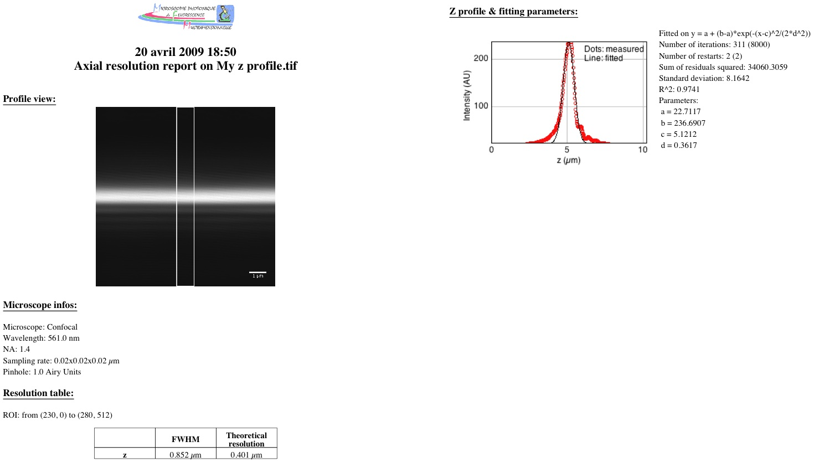

* ***Profile view***: a calibrated image of the profile, including the ROI's outlines;
* ***Microscope infos***: summarizes informations about the acquisition system and the image's calibration;
* ***Resolution table***: carries both the ROI's position, as well as axial resolutions (experimental and theoretical);
* ***z profile and fitting parameters***: contains a plot of the intensity profile along the z axis and the fitted curve. On the right side of the graph stand the fitting parameters:
	* equation against which the profile is fitted;
	* number of iterations: self-explanatory;
	* sum of residuals squared: sum of the differences between the original intensity values and the fitted ones, squared;
	* standard deviation: standard deviation of the residuals;
	* the correlation coefficient $R^{2}$ (gives indication on the fitting goodness).
	* the Gaussian's constants a to d, c being the position of the beads centre along the x axis;
* ***Sample infos (optional)***: contains the informations entered by the user in the "Sample infos" section of the interface;
* ***Comments (optional)***: contains the informations entered by the user in the "Comments" section of the interface;

## Known issues (to date...) and workarounds (if any...)

None...yet.

---

# Generate co-alignement report
## How to generate the images ?
### How to prepare the sample ?
*This sample preparation is aimed at obtaining an array of fluorescent, multi-labelled beads, well appart one from the other, and stably stuck to a coverslip.*

#### What do I need ?
* ***Fluorescent beads:*** their outer diameter should be well above the resolution of the system to test. Two types of beads might be used:
	* Uniformly labelled beads. ex: Molecular Probes' [4µm TetraSpeck, Ref. T-7283](http://probes.invitrogen.com/media/pis/mp07279.pdf). However, their diameter is a bit small for low NA objectives\...
	* Non-uniformly labelled beads (inner core carrying one fluorescence, outer ring another). ex: Molecular Probes' [FocalCheck](http://probes.invitrogen.com/media/pis/mp07234.pdf).
* ***Regular slides***;
* ***Regular coverslips***: type 1.5 i.e. 0.17mm thick, either polylysine coated or not;
* If applicable, ***Poly-L-lysine solution*** (0.1 % (w/v) in $H_{2}O$) ex: [Sigma-Aldrich, Ref. P8920](http://www.sigmaaldrich.com/etc/medialib/docs/Sigma/generalinformation2/p8920.Par.0001.File.tmp/p8920.pdf);
* ***Ethanol***;
* ***Regular distilled water***;
* ***Mounting medium***: should be the same as for the regular, biological samples. Avoid using DAPI containing mounting media;
* ***Nail polish***: only in case the mounting solution is not a setting medium.

#### How do I do ?
1. Clean the coverslip and the slide using ethanol.
2. Dilute the polylysine stock solution to 1/5$^{th}$.
3. Poor a sufficient amount of the diluted polylysine solution onto the coverslip surface (typically, 200µl for a 24x24mm coverslip) and
leave to coat for 15-30 minutes. The solution hardly covers the full surface, so don't hesitate to use the pipet's tip to force the polylysine into the coverslip's corners.
4. Rince the coverslip 2-3 times in distilled water, then drain off the liquid.
5. Use a vortex to mix the beads' stock suspension.
6. Dilute the beads suspension in water. Here are some tips and facts:
	* Typically, 200µl for a 24x24mm coverslip will be requiered;
	* In general, the beads should not be diluted much from 1/10 to 1/100;
	* Tests should be done to define the appropriate dilution ratio;
	* Always vortex the suspensions between and after dilutions;
7. Poor a sufficient amount of the diluted beads suspension onto the coverslip surface and leave to sediment for at least 30 minutes. The solution hardly covers the full surface, so don't hesitate to use the pipet's tip to force the suspension into the coverslip's corners.
8. Rince the coverslip 2-3 times in distilled water to remove the unattached beads, then drain off the liquid.
9. Mount the coverslip on the slide by using the mounting medium. In case of non setting media, the coverslip should be sealed onto the slide using nail polish, while avoiding the latter to come under the coverslip.

NB: Other methods exists in order to produce beads slides, involving dilution in ethanol and leaving the suspension to evaporate. In this case, tests of higher beads dilution might be required. Please note that already prepared beads slides are commercially available (see [FocalCheck Fluorescent Microspheres Size Kit mounted on slide, Ref. F-24633 (6µm beads) and Ref. F-24634 (15µm beads)](http:// probes.invitrogen.com/media/pis/mp07234.pdf)). However, this kind of preparation doesn't always match with the real *in situ* resolution as the mounting medium might be different from the one used in everyday acquisitions.

### How to acquire the image ?
The following chart summarises the procedure for optimal image acquisition, in order to determine the co-alignement quality on a confocal microscope.

## What does it do ?
1. The plugin will generate two summed intensity projection of the stack along the y and z axes;
2. On each projection, histogram segmentation is done on the log of intensities, aiming at separating two populations of intensities (background and signal);
3. Each projection is thresholded is order to highlight the "signal pixels' population";
4. An ellipse is fitted to those pixels (i.e. to the bead's outline), and the coordinates of its centre of mass is determined.
5. Once all coordinates have been retrieved for each channel, distance between the centre from channel A and centre from channel B is calculated (in fact, all combinaisons of distances are calculated):

$$dist_{A-B}=\sqrt{(x_{B}-x_{A})^2+(y_{B}-y_{A})^2+(z_{B}-z_{A})^2}$$

6. For each couple of coordinates, a reference distance $r_{ref}$ is calculated. This distance is quite easy to determine in 2D as it corresponds to the xy resolution: while considering the centre of the structure on image A, a structure of image B will be co-localized if it is present within a circle traced around centre A of a radius equal to the xy resolution. Due to the disparate resolutions over the three dimensions, this distance is not so easy to calculate in 3D. However, the answer might come from the observation of the factor limiting the resolution: the PSF (Point Spread Function) and more precisely the first Airy disc which might be approximated in 3D as having an ovoid shape:

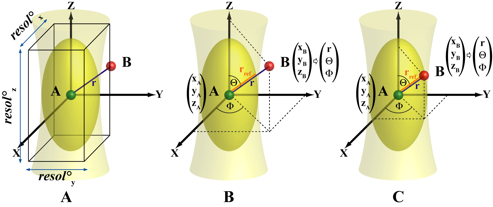

   
Therefore in 3D, the reference distance is calculated by considering a reference point and fitting a 3D ellipse around it for which the two characteristic radii correspond to x/y and z resolutions. In this matter changing from Cartesian coordinates to Polar coordinates make it more easy to calculate the reference distance. The two characteristic angles, the azimuth $\Phi$ and the zenith $\Theta$ and are first calculated, based on the coordinates of the two centres to analyse. Knowing this orientation, as well as the x, y and z resolutions ($res^\circ_{x}$, $res^\circ_{y}$ and $res^\circ_{z}$ respectively), the distance from the reference centre to the border of the ovoid shape **$r_{ref}$** is calculated. The inter-centre distance **$r$** is then compared to this reference distance to assess if co-localization occurs (see previous figure, section C) or not (see previous figure, section B).

$$\begin{aligned}
        \Phi=\arccos\frac{x_{B}-x_{A}}{\sqrt{(x_{B}-x_{A})^2+(y_{B}-y_{A})^2}}\\
        \Theta=\arccos\frac{z_{B}-z_{A}}{\sqrt{(x_{B}-x_{A})^2+(y_{B}-y_{A})^2+(z_{B}-z_{A})^2}}\\
        r_{ref}=\sqrt{(res^\circ_{x}\times\sin\Theta\times\cos\Phi )^2+(res^\circ_{y}\times\sin\Theta\times\sin\Phi)^2+(res^\circ_{z}\times\cos\Theta)^2}
\end{aligned}$$

## How to use it ?
1. Start ImageJ.
2. Open two or three stacks containing exactly one bead.
3. Launch the plugin by going to Plugins/MetroloJ/Generate co-alignement report.
4. The plugin's interface should appear:

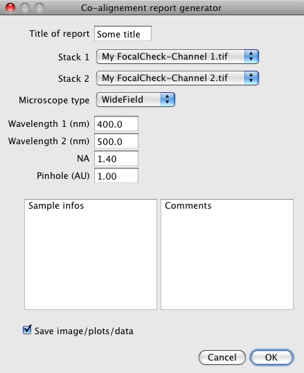

5. Enter a title for the report, choose which stack should be used for analysis (under "Stack 3", "none" might also be used), the microscope's type, enter the emission wavelength for each stack, the numerical aperture of the objective and the pinhole aperture. Sample informations and some comments might also be provided using the appropriate boxes. Ticking the "Save image/plots/data" will generate:
	* a jpeg image of the side-views;
	* a file containing tabulation separated values of all the numerical data from the report.
6. Click on Ok: a new dialog box appears, inviting the user to choose a folder where all data will be saved.
7. In case the stack selected under "Stack 1" has not been spatially calibrated, a message error pops up: click on Ok. In the calibration dialog box provide the appropriate values, then re-launch the plugin.
8. The pdf report is generated, and appropriate files saved.

## What's on the report ?
The co-alignement report is composed of two to three pages depending on the informations provided by the user. It is composed of up to 7 sections:

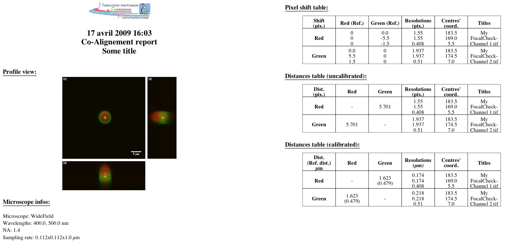

* ***Profile view***: image composed of three maximum intensity projections, XY, XZ and YZ;
* ***Microscope infos***: summarizes informations about the acquisition system and the image's calibration;
* ***Pixel shift table***: considering as a reference the channel stated at the beginning of each row, each column show how much pixels separate one channel from the reference along x, y and z axis. This information might be useful to compensate for chromatic aberration using image processing softwares. On each row, resolutions and centre's coordinates are given for the reference channel;
* ***Distance table (uncalibrated)***: contains distances calculated between two channels, while not taking into account the actual images's calibration;
* ***Distance table (calibrated)***: contains distances calculated between two channels, while taking into account the actual images's calibration. The distance printed between bracket is the reference distance;
* ***Sample infos (optional)***: contains the informations entered by the user in the "Sample infos" section of the interface;
* ***Comments (optional)***: contains the informations entered by the user in the "Comments" section of the interface;

## Known issues (to date...) and workarounds (if any...)
None...yet.
